# Tunts 🔝🌀
Esse é um projeto desenvolvido em NodeJS onde é utilizado a api do Google para ler, escrever e limpar os dados de uma table do Google Sheets.

# Quick Start ▶️

1. Tenha certeza que você tem o [Node](https://nodejs.org/en/) instalado no seu computador.
2. Clone o projeto em seu computador.
3. Abra o **Terminal**  na pasta do projeto e execute o comando `npm install ` para instalar as dependências do projeto.
4. O comando`npm run clean` irá limpar as Linhas/Colunas do Sheets
5. O comando `npm run update` irá atualizar a tabela do Sheets
6. 

> **OBS:** Se você tiver qualquer problema em instalar o **Node** ou alguma dúvida com o projeto, fique a vontade para me enviar mensagem!

## Explicação 
A tabela em que estamos trabalhando é um conjunto de dados de alunos, e suas respectivas: **faltas** e **notas**

Sabendo disso, precisamos atualizar duas colunas da tabela: 
* **Situação** e  **Nota para Aprovação Final** 

### Diagrama

```mermaid
graph LR
A[Aluno] -- Mais que 15 faltas? --> B[Reprovado por falta] 
A -- Menos que 15 faltas? --> C((Nota))
C -- Maior que 70 ? --> G(Aprovado)
C -- Maior ou igual a 50 e menor que 70? --> Z(Exame Final)
C -- Menor que 50 ? --> S[Reprovado por nota]
Z -- Calcular Nota para Aprovação Final --> L(5 <= m + naf/2)

```

